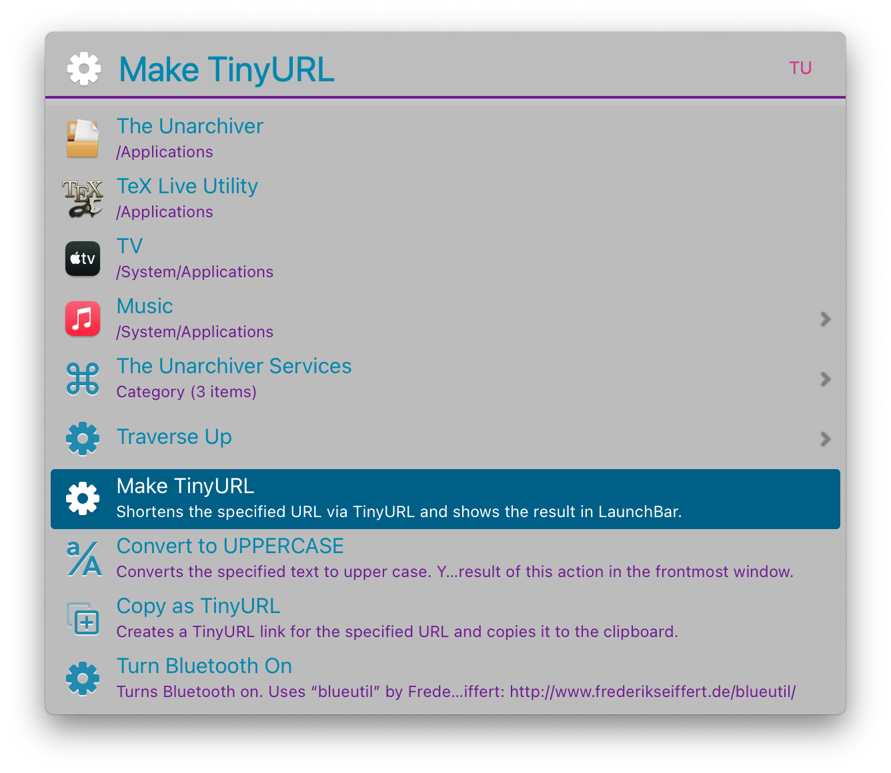

# Introduction

I've made this theme using the vim [Papercolor Light palette](https://github.com/NLKNguyen/papercolor-theme). Feel free to use it in any way you want. 

# Now to install

Download, rename to ```Papercolor light.lbtheme``` and click on it. Launchbar will import the theme. 



